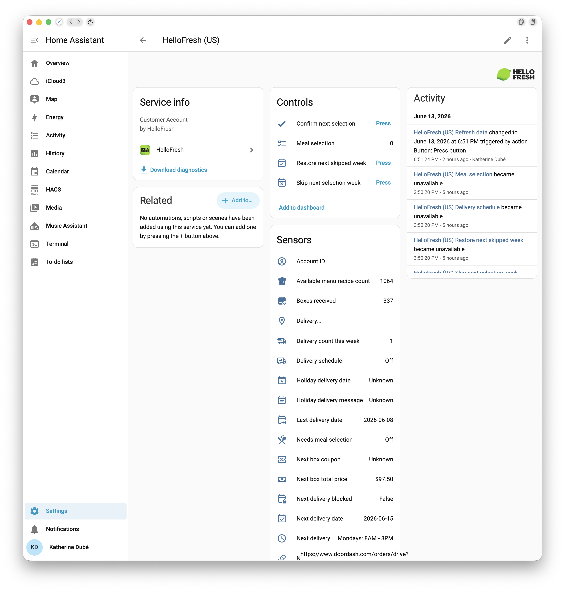

# HelloFresh Integration for Home Assistant

A custom Home Assistant integration that reads your HelloFresh account and menu data so you can track upcoming deliveries, shipment status, recipe selection deadlines, and week-by-week meal planning directly from Home Assistant.

It also exposes delivery-history summaries, shipment tracking metadata, billing/payment dates, and authenticated menu and profile details when those endpoints are available for your region and account.

> ⚠️ This is an **unofficial** integration, reverse-engineered from the HelloFresh website. It is not affiliated with or endorsed by HelloFresh, and the underlying API may change at any time.

## Contents

- [Installation](#installation)
- [Configuration](#configuration)
- [What It Provides](#what-it-provides)
- [Example Dashboard](#example-dashboard)
- [Troubleshooting](#troubleshooting)
- [Diagnostics](#diagnostics)
- [Development](#development)

## Installation

> Home Assistant requirement:
>
> - Home Assistant Core with support for config flows, diagnostics, and custom integrations

### Method 1: HACS custom repository

1. In Home Assistant, open **HACS**.
2. Open the menu in the top-right corner (**⋮**) and select **Custom repositories**.
3. Paste this repository's URL: `https://github.com/kedube/HA-HelloFresh`
4. Set the category to **Integration** and click **Add**.
5. Search for **HelloFresh** in HACS, open it, and click **Download**.
6. Restart Home Assistant.

After restart, add the integration from Home Assistant:

### Method 2: Manual installation

1. Copy `custom_components/hellofresh` into your Home Assistant `config/custom_components` directory.
2. Restart Home Assistant.
3. Add the integration from **Settings > Devices & services > Add integration**.

## Configuration

HelloFresh has no official API or OAuth app, so the integration logs in with your **HelloFresh account email and password**, the same way the website does. Home Assistant uses your credentials to obtain a short-lived access token plus a long-lived refresh token, then keeps the connection refreshed automatically — no developer tools, cookies, or token copying required.

### Setting up

1. Add the integration (see [Installation](#installation)).
2. Choose your **Country** (see [Supported regions](#supported-regions)).
3. Enter the **email** and **password** you use to sign in to HelloFresh.
4. Submit. Home Assistant signs in, validates the account, and stores the resulting tokens so it can refresh access on its own.

> 🔒 **About your credentials.** Your email and password are stored in the Home Assistant config entry and used only to log in to HelloFresh's own login endpoint and to re-authenticate when the refresh token eventually expires. They are redacted from diagnostics exports. As with any third-party integration, the security of your credentials depends on the security of your Home Assistant installation.

### Reauthentication

The integration renews the short-lived access token automatically using the long-lived refresh token, and falls back to a full login with your stored credentials when the refresh token is rejected or has expired. If a login ever fails (for example you changed your HelloFresh password), Home Assistant raises a reauthentication prompt for the config entry — just enter your current email and password to restore access.

### Options

Open the integration options to adjust:

- **Refresh interval (minutes)** — how often account data is polled. Default is **180**; allowed range is **5–1440**. (This is the data-refresh cadence; the bearer token is refreshed on its own faster-running schedule regardless of this value.)
- **Use public menu fallback** — when authenticated menu data is unavailable, scrape the public regional menu page so recipe data still appears.

### Supported regions

Choose the matching country during setup:

| Region | Code | Website |
| --- | --- | --- |
| United States | `us` | https://www.hellofresh.com |
| Canada | `ca` | https://www.hellofresh.ca |
| United Kingdom | `uk` | https://www.hellofresh.co.uk |
| Australia | `au` | https://www.hellofresh.com.au |
| Germany | `de` | https://www.hellofresh.de |
| Netherlands | `nl` | https://www.hellofresh.nl |

## What It Provides

### Entities

#### Sensors

Sensors are grouped below by purpose. The **Name** column is the friendly label shown in Home Assistant; the **Entity** column is the entity ID suffix. Most expose extra detail (full order, week, subscription, and tracking objects) as entity attributes.

**Deliveries & orders**

| Name | Entity | Description |
| --- | --- | --- |
| Next delivery date | `sensor.next_delivery_date` | Delivery date of the next upcoming order (today or later). Sourced from the order record. `Date` device class. |
| Next order status | `sensor.next_order_status` | Status of the next upcoming order (e.g. `pending`, `shipped`, `delivered`). The icon reflects the current state. |
| Next delivery slot | `sensor.next_delivery_slot` | Delivery time-slot label for the next order (e.g. `Mondays: 8AM - 8PM`); `None` when no preferred window is set. |
| Upcoming delivery count | `sensor.upcoming_delivery_count` | Number of orders with a delivery date today or later. |
| Delivery count this week | `sensor.delivery_count_this_week` | Number of deliveries scheduled within the current calendar week (Mon–Sun). |
| Next delivery week | `sensor.next_delivery_week` | **ISO week identifier** of the next configurable delivery week (e.g. `2026-W25`) — the same week used by the meal-selection sensors below. A week label, deliberately distinct from `Next delivery date` (which is the box's actual delivery day); derived from the week's ISO id, falling back to the delivery date's ISO week. Plain string (no device class). |
| Next delivery blocked | `sensor.next_delivery_blocked` | `True`/`False` flag for whether HelloFresh has blocked delivery for the next configurable week (e.g. unavailable in your area that week). |
| Holiday delivery date | `sensor.next_holiday_delivery_date` | Rescheduled delivery date when the next week's box is shifted for a holiday; `None` when no holiday shift applies. `Date` device class. |
| Holiday delivery message | `sensor.next_holiday_message` | HelloFresh's holiday-shift notice for the next week (e.g. why the date moved); `None` when no holiday message is present. |

**Meal selection**

| Name | Entity | Description |
| --- | --- | --- |
| Weeks needing meal selection | `sensor.weeks_needing_selection` | Count of upcoming weeks that still require meal selection. Attributes list every pending week. |
| Next selection deadline | `sensor.next_selection_deadline` | Cutoff timestamp (date + time) for the next configurable week — useful for reminder automations. `Timestamp` device class. |
| Selected meal count | `sensor.selected_meal_count` | Meals already chosen for the next pending week; `0` when none is pending. Excludes add-on and market items. |
| Number of meals | `sensor.required_meal_count` | Meals that must be selected for the next pending week; falls back to the subscription's plan count when the week doesn't specify one. |

**Billing & payments**

| Name | Entity | Description |
| --- | --- | --- |
| Next box total price | `sensor.next_box_total_price` | Sum of all charges for the next upcoming delivery date, across every billing item for that date. Monetary device class; the unit reflects the subscription currency. |
| Recent payment date | `sensor.recent_payment_date` | Date of the most recent HelloFresh charge that has **already been billed** (the order's `createdAt`), from order history. Because HelloFresh bills a box a few days before it ships, this reflects your last actual charge even when that box's delivery is still upcoming. Charges dated in the future are ignored. `Date` device class. |
| Next payment date | `sensor.next_payment_date` | Estimated date of the next charge — the upcoming order's delivery date, falling back to the subscription's next cutoff date. `Date` device class. |
| Next order ID | `sensor.recent_order_id` | Order number for the next upcoming delivery, as shown in the HelloFresh UI (the `orderNr` field). |
| Next box coupon | `sensor.next_box_coupon` | Active promo/coupon code applied to the primary subscription; `None` when no coupon is on file. |

**Account & subscription**

| Name | Entity | Description |
| --- | --- | --- |
| Selected plan | `sensor.selected_plan` | Plan name from the primary subscription (e.g. `Meat & Veggies`); shows the display name when a specific plan name isn't returned. |
| Number of people | `sensor.number_of_people` | Servings-per-box setting from the primary subscription (e.g. `2`). |
| Subscription count | `sensor.subscription_count` | Number of active HelloFresh subscriptions on the account. |
| Delivery address | `sensor.delivery_address` | Single-line delivery address from the primary subscription; redacted in diagnostics exports. |
| Account ID | `sensor.account_id` | HelloFresh customer account ID. |
| Boxes received | `sensor.boxes_received` | Lifetime count of boxes delivered to the account, from the authenticated profile endpoint. |
| Available menu recipe count | `sensor.public_menu_recipe_count` | Number of recipes on the current week's public menu; `0` when menu data is unavailable. |

**Shipment tracking**

| Name | Entity | Description |
| --- | --- | --- |
| Shipment tracking status | `sensor.shipment_tracking_status` | Tracking status of the best-tracked order (in transit, delivered, exception). The icon reflects the state; `None` when no tracked shipment exists. |
| Shipment tracking number | `sensor.shipment_tracking_number` | Parcel/tracking number for the tracked shipment; shares attributes with the tracking-status sensor. |
| Tracked shipment carrier | `sensor.tracked_shipment_carrier` | Carrier for the tracked shipment (e.g. `UPS`, `FedEx`, `DoorDash`); `None` when no tracking data is present. |
| Next delivery tracking URL | `sensor.next_delivery_tracking_url` | Direct carrier tracking link for the best-tracked order; `None` when no link is available. |

**History & skipped weeks**

| Name | Entity | Description |
| --- | --- | --- |
| Last delivery date | `sensor.last_delivery_date` | Delivery date of the most recently completed week from delivery history. `Date` device class. |
| Skipped week count | `sensor.skipped_week_count` | Number of upcoming weeks marked as skipped. |
| Next skipped week | `sensor.next_skipped_week` | Display name of the nearest upcoming skipped week (e.g. `2026-W24`); `None` when none are skipped. |

**Diagnostic** (shown under the device's *Diagnostic* section; some disabled by default)

| Name | Entity | Description |
| --- | --- | --- |
| Delivery subscription ID | `sensor.next_delivery_subscription` | Internal HelloFresh subscription ID for the next order. Diagnostic. |
| Access token time remaining | `sensor.access_token_minutes_remaining` | Whole minutes until the current access token expires (unit `min`). Access tokens are short-lived (~30 min) and auto-refreshed. Attributes expose the exact `expires_at` timestamp and `seconds_remaining`. Diagnostic. |
| Refresh token time remaining | `sensor.refresh_token_days_remaining` | Whole days until the refresh token expires (unit `d`). When the refresh token expires the integration logs in again with your stored credentials; if that login fails you are prompted to reauthenticate. Attributes expose the exact `expires_at` timestamp and `seconds_remaining`. Diagnostic. |
| API base URL | `sensor.api_base_url` | Regional API base URL the integration is using. Diagnostic; **disabled by default**. |

#### Binary sensors

| Entity | Notes |
| --- | --- |
| `binary_sensor.needs_meal_selection` | `True` when at least one upcoming delivery week still requires meal selection; the primary signal for reminder automations |
| `binary_sensor.selection_deadline_passed` | `True` when the next pending selection week's cutoff timestamp has passed; fires even when meals are already chosen, because HelloFresh allows swaps until the deadline |
| `binary_sensor.account_menu_api_available` | `True` when the integration has successfully loaded structured menu data from authenticated API responses; diagnostic entity, disabled by default; the Repairs issue is the primary signal when fallback is active |
| `binary_sensor.write_actions_available` | `True` when the account advertises at least one supported write action (meal selection, skip/unskip, reschedule, delivery-weekday change, etc.); diagnostic entity, disabled by default |
| `binary_sensor.reschedule_available` | `True` when the account allows a one-off delivery change for an upcoming week (gates the `reschedule_week` service); diagnostic entity, disabled by default |
| `binary_sensor.delivery_weekday_change_available` | `True` when the account allows changing the recurring delivery weekday/interval (gates the `change_delivery_weekday` service); diagnostic entity, disabled by default |
| `binary_sensor.tracked_shipment_available` | `True` when the most-recent order has active shipment tracking data (carrier, tracking number, or tracking URL) |
| `binary_sensor.payload_shape_changed` | `True` when HelloFresh returned authenticated data that the integration could not fully parse; signals that an API update may require integration changes; a matching Repairs issue is also raised |
| `binary_sensor.first_box_delivered` | `True` once the account has received at least one box; becomes permanently `True` after the first delivery; diagnostic entity, disabled by default |

#### Other

| Entity | Notes |
| --- | --- |
| `calendar.delivery_schedule` | Calendar entity showing all upcoming and recent HelloFresh deliveries as calendar events; each event title includes the delivery week and order status |
| `todo.meal_selection` | To-do list with one item per week that needs meal selection; marking an item complete submits the currently selected recipes for that week to HelloFresh |
| `button.refresh_data` | Triggers an immediate coordinator refresh outside the normal polling interval |
| `button.confirm_next_selection` | Submits meal confirmation for the next pending selection week using the current recipe selections |
| `button.skip_next_selection_week` | Marks the next upcoming delivery week as skipped on the HelloFresh account |
| `button.restore_next_skipped_week` | Restores (unskips) the nearest upcoming skipped delivery week |

Order, week, menu, subscription, capability, and tracking details are exposed as entity attributes, and authenticated history endpoints feed recent delivered-week context into the delivery-history sensors' attributes. Full per-week recipe lists are intentionally **not** included in attributes (to stay under the recorder's size limit — see [Recorder attribute sizes](#recorder-attribute-sizes)); they remain available in the diagnostics export.

A few entity IDs differ from their displayed names — for example `sensor.required_meal_count` shows as **Number of meals**, `sensor.public_menu_recipe_count` as **Available menu recipe count**, and `sensor.recent_order_id` as **Next order ID** (see the Name column above).

### Voice and Assist

The integration now registers HelloFresh intent handlers for:

- next delivery status
- meal-selection status
- manual refresh

These handlers are intended for Home Assistant conversation workflows and future sentence matching support.

### Services

- `hellofresh.refresh_data`
- `hellofresh.select_meals`
- `hellofresh.skip_week`
- `hellofresh.unskip_week`
- `hellofresh.reschedule_week` — move a single week's delivery to a different delivery option (one-off)
- `hellofresh.change_delivery_weekday` — change the recurring delivery option/interval for a plan (affects all future deliveries)

When multiple HelloFresh accounts are configured, service calls can target a specific entry with `config_entry_id`.

The integration also supports a lightweight actionable flow inside Home Assistant:

- marking a `todo.meal_selection` item complete submits the currently selected recipes for that week
- `button.confirm_next_selection` attempts to confirm the next pending week
- `button.skip_next_selection_week` and `button.restore_next_skipped_week` attempt the matching account action

Meal selection and skip/unskip use the same write endpoints the HelloFresh website uses. If one is unavailable for your region or account shape, the integration tries a small set of fallbacks and, if none work, raises a Repairs issue instead of silently sending more guesses.

## Example Dashboard

A ready-to-use Lovelace dashboard is included at [`examples/dashboard.yaml`](examples/dashboard.yaml), organized around how you actually use HelloFresh:

- **Overview** — a hero "next box" card (date with a relative countdown and status-colored icon) plus key facts as chips, meal-selection progress as a gauge with the confirm/skip/restore buttons, a per-week breakdown table of weeks still needing a selection, the meal to-do list, and a shipment-tracking card with a tappable carrier link. Conditional banners surface only when relevant: meals needing selection, a holiday delivery change, an approaching reauthentication deadline, or an unexpected-payload warning.
- **Planning** — the delivery calendar, upcoming/skipped counts, key dates, and a 90-day order/tracking history graph.
- **Account** — billing dates, active coupon, subscription details, and a manual refresh button.
- **Diagnostics** — token-expiry and integration-health entities, tucked out of the way.

The **Overview** view uses two popular HACS frontend cards — [Mushroom](https://github.com/piitaya/lovelace-mushroom) (hero card, chips, tappable tracking link) and is otherwise built-in. The Planning, Account, and Diagnostics views need no add-ons. Each Mushroom card has a commented built-in fallback (e.g. a `glance` "next box" and a plain `attribute` tracking row) inline in the file, so you can drop the HACS dependency entirely if you prefer.

The per-week breakdown and the tappable tracking link read directly from entity **attributes** (the `weeks` list on the selection-deadline sensor and `tracking_url` on the tracking-status sensor) — data the headline state alone doesn't show.

To use it:

1. Optionally install **Mushroom** via **HACS → Frontend** (or use the built-in fallbacks noted in the file).
2. Open **Settings → Dashboards → ⋮ → Edit in YAML** (or add a new YAML-mode dashboard) and paste the file's contents.
3. Update the entity-ID prefix. Because entities use `has_entity_name`, their IDs derive from your config-entry title — a "HelloFresh (US)" account produces IDs like `sensor.hellofresh_us_next_delivery_date`. The example uses the `hellofresh_us_` prefix throughout; **find-and-replace it** with the prefix your account actually uses (check **Settings → Devices & Services → HelloFresh → entities** for the real IDs).

### Recorder attribute sizes

Sensor state attributes are kept small so the recorder stores them without hitting Home Assistant's 16 KB per-state attribute limit. The full recipe catalog for a week (which can be large once the authenticated menu loads) is intentionally **not** embedded in any sensor attribute — the per-week `weeks` list on `sensor.hellofresh_us_next_selection_deadline` and the single-week context objects on other sensors carry only scalar week metadata (dates, deadline, meal counts, slot). No recorder `exclude` configuration is required.

The complete recipe data is still available where it matters: the meal-selection actions read it from the live integration state, and a full serialization (with recipes) is included in the redacted **diagnostics** export for debugging.

## Current Scope

What works:

- email/password login through the HelloFresh `/gw` auth gateway, with automatic access-token refresh and credential-based re-login
- token validation against `/gw/api/customers/me/subscriptions`
- account delivery and order parsing from verified or likely `/gw/...` delivery endpoints
- aggregation across multiple subscriptions on the same HelloFresh account
- account profile metrics such as delivered box counts when exposed by authenticated profile endpoints
- delivered-week history summaries from authenticated past-delivery endpoints
- richer recipe parsing including ingredient, nutrition, image, and tag metadata when present
- authenticated menu API attempts before falling back to public HTML scraping
- shipment tracking extraction and SCM enrichment when the payload includes carrier, parcel, or HelloFresh tracking-page details
- public menu scraping from the regional `/menus` page
- reminders driven by `binary_sensor.needs_meal_selection`
- delivery calendar plus deadline timestamp and binary deadline sensors
- meal-selection to-do list generation with completion-to-confirm support
- service and button write actions for meal selection and skip/unskip, using the website's own write endpoints with conservative fallbacks
- Repairs issues when the integration falls back to public menu data, sees unexpected payload shapes, or cannot verify a write action

What is not implemented yet:

- a first-party OAuth / account-linking flow (the integration logs in directly with your stored email and password instead)
- verification of the write endpoints beyond the US site (the US meal-selection and skip/unskip requests are confirmed; other regions fall back to best-effort guesses)
- live push updates from HelloFresh, if an official push channel exists
- a packaged custom Lovelace card (an example YAML dashboard is provided — built-in cards plus optional Mushroom on the Overview view, see [Example Dashboard](#example-dashboard))

Because HelloFresh does not publish a stable consumer integration contract here, write actions stay cautious: the integration uses the website's confirmed write endpoints first, tries a small set of fallbacks if those don't fit your account, and stops with a clear error rather than guessing endlessly.

## Troubleshooting

**The integration keeps asking me to reauthenticate.**
This means HelloFresh rejected a login with your stored credentials — most often because the account password changed, or HelloFresh required an extra verification step. Open the reauthentication prompt and enter your current HelloFresh email and password. Make sure you selected the **correct region** during setup, since each region is a separate HelloFresh login.

**Setup fails with "Invalid authentication."**
HelloFresh rejected the email/password. Double-check the credentials, confirm you can sign in to the **correct regional** HelloFresh website with them, and that you picked the matching **Country**.

**Setup fails with "Could not connect."**
Home Assistant could not reach HelloFresh, or the response wasn't understood. Check Home Assistant's network access and try again; transient site errors usually clear on a retry.

**The log shows "login BLOCKED by bot protection" (HTTP 403 with an HTML page).**
HelloFresh's website fronts its login with bot protection that sometimes blocks automated sign-ins. This is **not** a wrong-password problem — the request was rejected before it reached the login API, so re-entering your credentials won't help. The integration treats this as temporary and retries on its next poll, so it usually clears on its own. If it persists, confirm you can still log in to the HelloFresh website in a normal browser; a server-side block on your account or IP would need to clear before the integration can sign in.

**Recipe details are missing or a "menu fallback" Repairs issue appears.**
The integration couldn't load structured menu data from the authenticated API and fell back to scraping the public menu page. Delivery tracking still works; recipe details may be less complete until the API payload is recognized again.

**A "payload shape changed" Repairs issue appears.**
HelloFresh returned account data the integration couldn't fully parse — usually a sign the website changed. Attaching a [diagnostics export](#diagnostics) to a GitHub issue is the most helpful thing you can do here.

## Diagnostics

This integration includes Home Assistant diagnostics support for config entries, with sensitive values redacted before export. Diagnostics include capability flags, subscription summaries, parsed order data, menu fallback state, delivery/tracking debug attempts, and the normalized serialized account views used by entities.

To download a diagnostics export: **Settings → Devices & services → HelloFresh → ⋮ (the three-dot menu) → Download diagnostics**. Tokens and personal details are redacted automatically, so it is safe to attach to a bug report.

For lower-level endpoint details and normalization notes, see [HELLOFRESH_API.md](HELLOFRESH_API.md).

## Development

This repository is structured as a HACS-compatible custom integration repository:

- integration code under `custom_components/hellofresh`
- metadata in `custom_components/hellofresh/manifest.json`
- HACS metadata in `hacs.json`
- translations in `custom_components/hellofresh/translations/`
- local brand assets in `custom_components/hellofresh/brand/`

It also includes:

- a pytest suite for API normalization, serialization behavior, the email/password auth and token-refresh lifecycle, and richer capability helpers
- a GitHub Actions workflow for `hassfest` and `python -m pytest -q`
- issue templates for bug reports and feature requests
- a [contributing guide](CONTRIBUTING.md)
- a ready-to-use [example dashboard](examples/dashboard.yaml) (see [Example Dashboard](#example-dashboard))
- a documented [quality-scale target](QUALITY_SCALE.md)

Recent local verification included:

- `python3 -m pytest -q`
- `python3 -m compileall custom_components/hellofresh`

## References

- Reverse-engineered example used to validate current auth and endpoint assumptions:
  - https://github.com/CNoetzel/HelloFresh-RecipeDownloader
  - https://raw.githubusercontent.com/CNoetzel/HelloFresh-RecipeDownloader/master/downloader.py
- HACS documentation:
  - https://hacs.xyz/docs/publish/integration/
- Home Assistant developer documentation:
  - https://developers.home-assistant.io/docs/creating_integration_manifest/
  - https://developers.home-assistant.io/docs/core/integration/config_flow/
  - https://developers.home-assistant.io/docs/internationalization/custom_integration/
